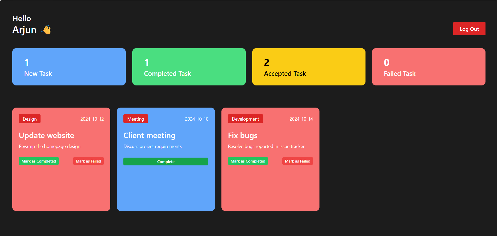
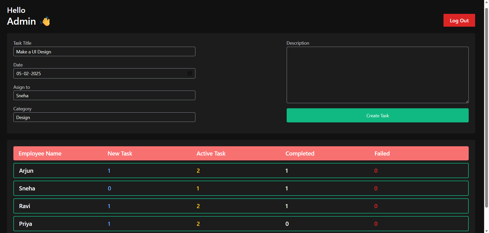

# TaskHive – Role-Based Task Management Dashboard

# Overview
TaskHive is a role-based task management web application built using React. It enables an admin to assign tasks to employees, while employees can accept, complete, or mark tasks as failed.

# Key Features
- Role-based authentication (Admin & Employee)
- Task assignment by admin
- Task lifecycle management (New → Active → Completed / Failed)
- Real-time UI updates using React Context API
- State persistence using localStorage
- Responsive and modern UI with Tailwind CSS

# Tech Stack
- React.js
- JavaScript (ES6+)
- Context API (State Management)
- Tailwind CSS
- Vite

# Project Structure
- `src/components` – UI components
- `context` – global state management
- `dashboard` – admin and employee dashboards

# Demo Credentials
Admin:
- Email: admin@me.com
- Password: 123

Employee:
- Email: employee2@example.com
- Password: 123

# Current Status
Frontend fully functional. Backend integration (Node.js + MongoDB) is under development.

# Future Enhancements
- Backend integration with Node.js & MongoDB
- REST API implementation
- JWT-based authentication
- Deployment (Vercel / Netlify)

# Highlights
- Implemented component-based architecture
- Managed application state efficiently using Context API
- Designed scalable UI for role-based workflows
## Screenshots

### Employee Dashboard

### Admin Dashboard

